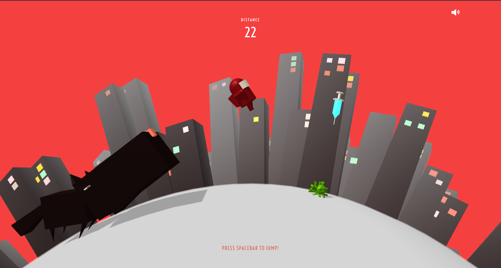

# coro-jump!

🎨 [**Try it! coro-jump**](https://kevnw.github.io/coro-jump/)

🔗 [**Devpost submission**](https://devpost.com/software/coro-jump)

In the midst of this pandemic, we believe that many people overlooked the fears of and sacrifices made by our frontline health workers in fighting the virus. Although it is not plausible for many to experience it firsthand, we hope that the experience they obtain by playing this game will somewhat illustrate it. In designing this project, we are also inspired by Google's running dinosaur game.

coro-jump is an endless running game that tests players' reflexes. The objective of the game is to run away from the beast by collecting vaccines and evading the virus. By collecting the vaccine, the character will gain extra movement speed, thus helping him to escape further from the monster. Along the run, also do not forget to practice safe distancing and evade the viruses on the road.

